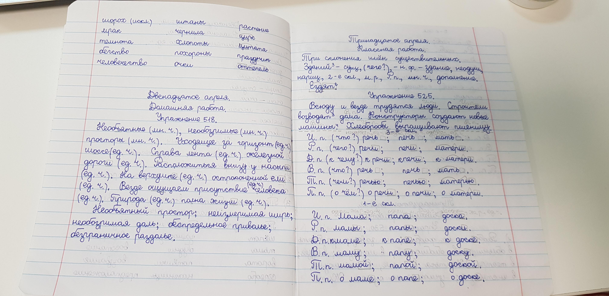
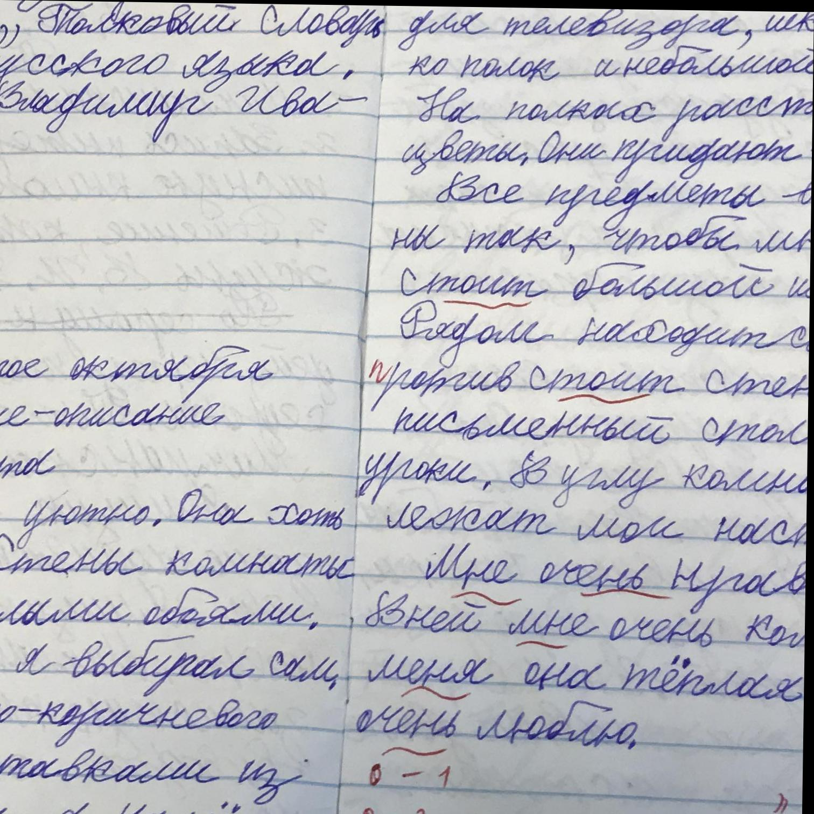

# 📝 Детекция рукописного текста на основе YOLOv8

***

## 📂 Структура проекта

| Файл / Папка | Описание |
| :--- | :--- |
| 📁 `/detect outputs` | Результаты работы моделей (изображения с детекцией) |
| 📁 `/examples` | Папка с исходными изображениями датасета для тестирования |
| 📁 `/readme` | Изображения для оформления README.md |
| 📄 `requirements.txt` | Список необходимых библиотек и зависимостей |
| 🐍 `text_detector.py` | Основной скрипт: разметка изображений, вывод результата или сохранение |
| 🐍 `video_splitter.py` | Скрипт для покадровой нарезки видео |

***

## Установка

### Предварительные требования
*   **OS:** Windows
*   **Python:** 3.11.4

### Инструкция по установке

1.  Создайте виртуальное окружение:
    ```bash
    python -m venv venv
    ```
2.  Активируйте окружение:
    *   **PowerShell:** `.\venv\Scripts\Activate`
    *   **CMD:** `venv\Scripts\activate`
3.  Установите зависимости:
    ```bash
    pip install -r requirements.txt
    ```

***

## Используемые датасеты

Для обучения модели использовались два открытых набора данных с изображениями школьных тетрадей на русском языке

### 1. AI Forever School Notebooks (HuggingFace)
*   **Ссылка:** [HuggingFace Dataset](https://huggingface.co/datasets/ai-forever/school_notebooks_RU)
*   **Размер:** 2.8 Gb
*   **Состав:**
    *   Тренировочная выборка: **1557** изображений
    *   Валидационная выборка: **150** изображений
*   **Особенности:** Содержит разметку как для детекции (bbox), так и для сегментации (polygons)

<div align="center">

<p><em>Пример изображения из первого датасета</em></p>
</div>

### 2. Russian Handwritten Text (Roboflow)
*   **Ссылка:** [Roboflow Universe](https://universe.roboflow.com/max-kuznetsov/russian-handwritten-text/dataset/3)
*   **Размер:** 0.7 Gb
*   **Состав:**
    *   Тренировочная выборка: **2325** изображений
    *   Валидационная выборка: **170** изображений

<div align="center">

<p><em>Пример изображения из второго датасета</em></p>
</div>

***

## Процесс обучения

### Методология
В ходе экспериментов было выявлено переобучение модели при длительном цикле (200+ эпох) на одном датасете. Анализ метрик Loss и mAP показал, что оптимальным решением является разбиение процесса обучения и последовательное использование двух датасетов.

Для финальной версии была выбрана более глубокая архитектура **YOLOv8m** (вместо версии *s*), что позволило улучшить качество детекции.

> **Характеристики модели YOLOv8m:**
> *   Layers: 169
> *   Parameters: 25,856,899
> *   Gradients: 25,856,883
> *   GFLOPs: 79.1