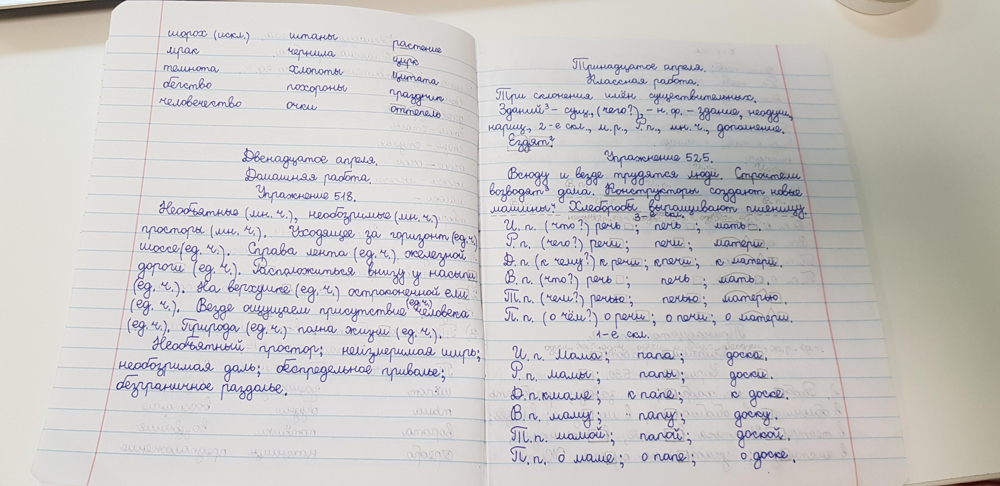
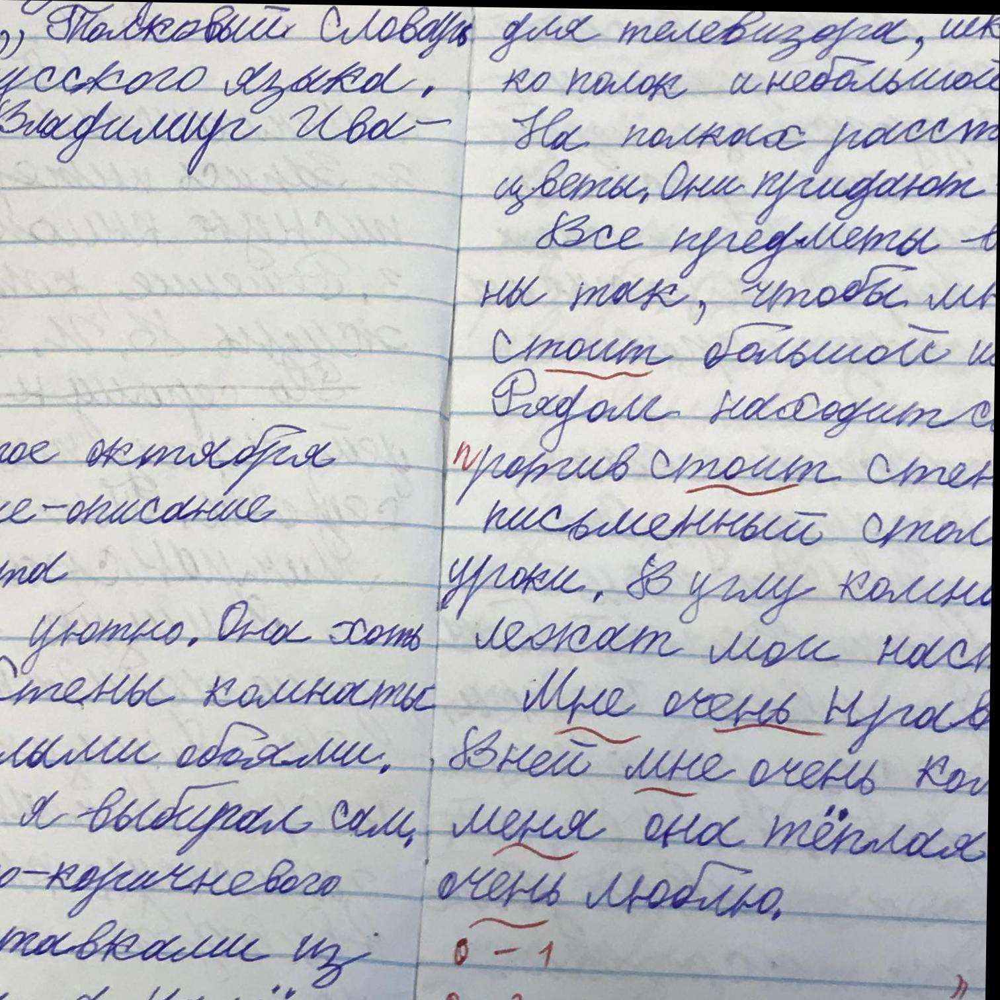

# 📝 Text Detector 
Веб-интерфейс для распознавания текста на изображениях (OCR). Проект создан для работы с моделями ИИ через API.

**Стек технологий:** React, TypeScript, Vite, Tailwind CSS

---

## 🚀 Быстрый запуск

1.  **Клонирование репозитория:**
    ```bash
    git clone 
    cd 
    ```

2.  **Установка зависимостей:**
    ```bash
    npm install
    ```

3.  **Запуск в режиме разработки:**
    ```bash
    npm run dev
    ```
    Интерфейс будет доступен по адресу **http://localhost:3000**.

---

## ⚙️ Требования к API модели

Для полноценной работы интерфейс **обязательно** требует запущенного бэкенд-сервера с моделью распознавания.

**Сервер должен:**

1.  Принимать `POST` запросы по адресу: `http://localhost:5000/api/recognize`
    *(Этот адрес можно изменить в файле `src/App.tsx` в функции `transcribeDocument`)*.

2.  Принимать JSON в теле запроса в следующем формате:
    ```json
    {
      "image": "iVBORw0KGgoAAA...", 
      "confidence_threshold": 70
    }
    ```
    - `image`: Картинка, закодированная в **Base64** (строка)
    - `confidence_threshold`: Порог уверенности от пользователя (число от 0 до 100)

3.  Возвращать JSON в ответ **строго** в следующем формате:
    ```json
    {
      "confidence": 92,
      "lines": [
        {
          "text": "Распознанная строка 1",
          "boundingBox": [100, 150, 120, 300]
        },
        {
          "text": "Распознанная строка 2",
          "boundingBox": [130, 150, 150, 300]
        }
      ],
    }
    ```
    - `confidence`: Общая уверенность модели в результате (число от 0 до 100).
    - `lines`: Массив распознанных строк.
    - `text`: Текст строки.
    - `boundingBox`: Координаты рамки `[top, left, bottom, right]` в формате от 0 до 1000. Это поле **обязательно** для подсветки текста на изображении. Если его нет, подсветка работать не будет.


# 📝 Детекция рукописного текста на основе YOLOv8

***

## 📂 Структура проекта

| Файл / Папка | Описание |
| :--- | :--- |
| 📁 `/readme` | Изображения для оформления README.md |
| 📄 `requirements.txt` | Список необходимых библиотек и зависимостей |
| 🐍 `text_detector.py` | Сегментация слов с изображения и их последующее сохранение |
| 🐍 `full_detector.py` | Сегментация слов с изображения и их распознавания и запись получившегося текста в файл |
| 🐍 `download_weight.py` | Скачивает веса для YOLO модели в папку weights/ |
| 🐍 `app.py` | Запуск веб приложения (http://localhost:5000/) |

## Установка

### Предварительные требования
*   **OS:** Windows
*   **Python:** 3.11.4

### Инструкция по установке

1.  Создайте виртуальное окружение:
    ```bash
    py 3.11 -m venv venv
    ```
2.  Активируйте окружение:
    *   **PowerShell:** `.\venv\Scripts\Activate`
    *   **CMD:** `venv\Scripts\activate`
3.  Установите зависимости:
    ```bash
    pip install -r requirements.txt
    ```

## Использование

### download_weight.py

Запустите данный скрипт для установки весов, они нужны для корректной работы остальных функций

###  text_detector.py

Для сохранения изображений
```python
best_model_path = 'weights/best.pt'   # Изменить путь до лучшей модели
example_images = 'examples'           # Изменить путь до папки с изображения для теста
images_output = 'detect outputs/test' # Изменить путь до папки в которую будут сохранены найденные слова по отдельности
words_output_dir = ''                 # Изменить путь до папки, в которую требуются изображения каждого слова по отдельности
```

###  full_detector.py


```python
# НАСТРОЙКИ МОДЕЛЕЙ 
YOLO_MODEL_PATH = 'weights/last.pt'                            # Путь к YOLO модели
TROCR_MODEL_NAME = "cyrillic-trocr/trocr-handwritten-cyrillic" # Путь к TrOCR      
DEVICE = "cuda:0" if torch.cuda.is_available() else "cpu"      # Для работы на GPU
# Папки
example_images = 'examples'                      # Где хранятся изображения для чтения
images_output = 'final_results'                  # Куда сохранять картинки с текстом
words_output_dir = ''                            # Куда сохранять нарезанные слова/оставить '' если не требуется
text_file_output = 'full_text1.txt'              # Куда сохранить весь текст
```

###  app.py

Запускаем и заходим на локальный сервер http://localhost:5000/ 

## Используемые датасеты для обучения детекции YOLOv8s

Для обучения модели использовались два открытых набора данных с изображениями школьных тетрадей на русском языке

### 1. AI Forever School Notebooks (HuggingFace)
*   **Ссылка:** [HuggingFace Dataset](https://huggingface.co/datasets/ai-forever/school_notebooks_RU)
*   **Размер:** 2.8 Gb
*   **Состав:**
    *   Тренировочная выборка: **1557** изображений
    *   Валидационная выборка: **150** изображений
*   **Особенности:** Содержит разметку как для детекции (bbox), так и для сегментации (polygons)

<div align="center">

<p><em>Пример изображения из первого датасета</em></p>
</div>

### 2. Russian Handwritten Text (Roboflow)
*   **Ссылка:** [Roboflow Universe](https://universe.roboflow.com/max-kuznetsov/russian-handwritten-text/dataset/3)
*   **Размер:** 0.7 Gb
*   **Состав:**
    *   Тренировочная выборка: **2325** изображений
    *   Валидационная выборка: **170** изображений

<div align="center">

<p><em>Пример изображения из второго датасета</em></p>
</div>

